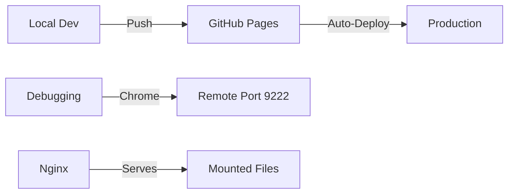

# AGENTS.md

This file provides architectural guidance for deployment and debugging.

## Deployment Guidelines
- Production URL: https://bali-island.github.io
- Deployment Method: GitHub Pages
- Restricted Actions:
  - No local servers except Nginx
  - No port conflicts (see `tmp/sysinfo.md`)

## System Constraints

## Network Architecture
- Tailscale domains configured in `tmp/sysinfo.md`
- Reserved ports documented in system info
- VPN access required for certain operations